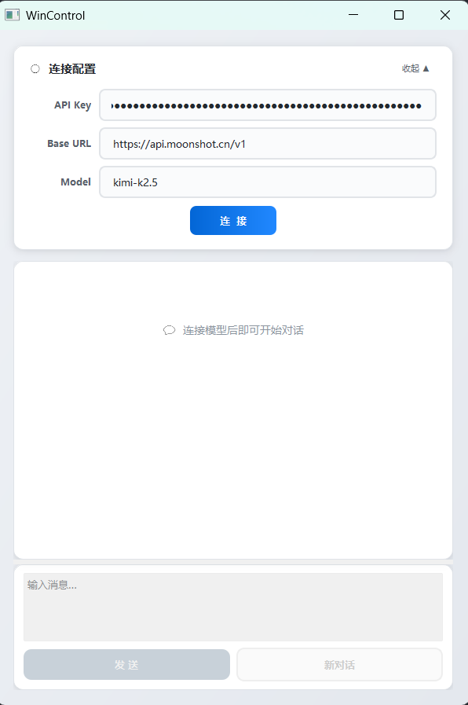

# WinControl

Windows GUI自动化Agent客户端，通过多模态大模型理解屏幕内容，结合OmniParser的YOLO检测定位界面元素，实现自动化的鼠标键盘操作。可以根据用户指令完成多步骤任务。



## 功能

- 理解屏幕截图，识别当前界面状态
- 定位按钮、输入框等可交互元素
- 自动点击、拖拽、输入文本、敲击快捷键
- 根据用户指令完成多步骤任务

## 架构

- 多模态大模型（视觉+推理）
- MCP Host（GUI客户端）
- MCP Server（设备控制服务端）
- OmniParser（YOLO检测GUI元素）
- 屏幕/鼠标/键盘控制

数据流：大模型 <-> Host <-> Server <-> OmniParser <-> 设备控制

## 目录结构

```
src/
├── wincontrol_server/    # MCP服务器
│   ├── devices/          # 屏幕、鼠标、键盘控制
│   ├── prompts/          # 系统提示词
│   ├── resources/        # 资源文件
│   ├── runtime/          # 坐标转换
│   ├── tools/            # MCP工具
│   └── server.py         # server入口
└── wincontrol_gui/       # GUI客户端
    ├── gui.py            # 界面+程序入口
    └── host.py           # MCP Host
```
